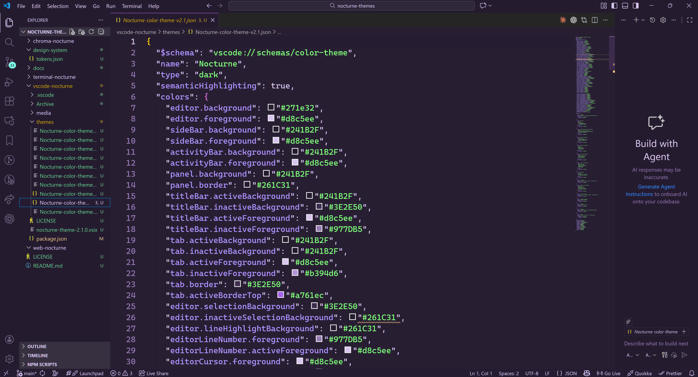

# Nocturne Nexus – VS Code Color Theme

Nocturne Nexus is a dark, purple-forward color theme for Visual Studio Code.  
It is designed for long coding sessions: deep violet backgrounds, soft lavender text, and high‑chroma accents for structure, behavior, values, and diagnostics.

This folder (`vscode-nocturne/`) contains the **VS Code extension** implementation of the Nocturne Nexus theme.

---

## Preview



> The screenshot above shows Nocturne Nexus applied to a workspace with the full UI chrome visible.

---

## Features

- Deep, low‑glare editor background tuned for extended use
- Clear semantic separation between:
  - **Structure**: types, classes, interfaces, constants, headings
  - **Behavior**: functions, methods, namespaces
  - **Values**: strings, numbers, booleans
  - **Diagnostics**: errors, warnings, info
- Consistent use of the same color roles as the broader **Nocturne Nexus design system** (editor, terminal, Chroma, web)
- Carefully tuned selections, search highlights, diff colors, and Git gutter markers

---

## Installation

### Local installation from VSIX

1. Build the extension from this folder (run in `vscode-nocturne/`):

   ```bash
   vsce package
   ```

   This produces a file such as:

   ```text
   nocturne-theme-2.1.1.vsix
   ```

2. In Visual Studio Code:

   1. Open the **Extensions** view.
   2. Click the **⋯** menu and choose **Install from VSIX…**.
   3. Select the generated `.vsix` file.

3. Set the theme:

   - Open the Command Palette → **Preferences: Color Theme**.
   - Choose **Nocturne Nexus**.

### From the Marketplace (future)

Once the extension is published:

1. Open the **Extensions** view.
2. Search for **“Nocturne Nexus”** by the publisher (for example, `KB4ptiste`).
3. Install and set it as your active color theme.

---

## Files and Structure

This folder is intended to live inside a larger repository (for example, `nocturne-themes/`).  
Typical layout inside `vscode-nocturne/`:

```text
vscode-nocturne/
├─ package.json
├─ themes/
│  └─ Nocturne-color-theme.json
├─ media/
│  ├─ icon.png
│  └─ nocturne-theme-preview.png
├─ .vscode/
│  ├─ launch.json
│  └─ extensions.json
├─ CHANGELOG.md
└─ .vscodeignore
```

### Key files

- **`package.json`**  
  Extension manifest. Declares the theme under `contributes.themes` and points to `themes/Nocturne-color-theme.json`. Also references `media/icon.png` as the extension icon.

- **`themes/Nocturne-color-theme.json`**  
  The current, canonical version of the Nocturne Nexus theme. Older experimental versions should be tracked via Git history or moved into an `Archive/` folder that is excluded from packaging.

- **`media/icon.png`**  
  128×128 PNG icon used in the Extensions view and Marketplace listing.

- **`media/nocturne-theme-preview.png`**  
  Screenshot of Nocturne Nexus running in VS Code, used in this README and Marketplace description.

- **`.vscode/launch.json`**  
  Launch configuration for running an **Extension Development Host** to test the theme.

- **`.vscode/extensions.json`**  
  List of recommended extensions for working on this project (for example, Prettier, JSON tools, etc.).

- **`CHANGELOG.md`**  
  Version history of the theme (for example, `2.0.0`, `2.1.0`, etc.).

- **`.vscodeignore`**  
  Glob patterns that tell `vsce` which files to **exclude** from the `.vsix` package.

---

## Development

### Run the theme in an Extension Development Host

1. Open the `vscode-nocturne/` folder in VS Code.
2. Ensure `.vscode/launch.json` contains a standard `extensionHost` configuration, for example:

   ```jsonc
   {
     "version": "0.2.0",
     "configurations": [
       {
         "name": "Launch Extension",
         "type": "extensionHost",
         "request": "launch",
         "runtimeExecutable": "${execPath}",
         "args": ["--extensionDevelopmentPath=${workspaceFolder}"]
       }
     ]
   }
   ```

3. Press **F5** to start an **Extension Development Host** window.
4. In the new window, select the **Nocturne Nexus** theme and test it against various file types (TypeScript, JSON, Markdown, Git diffs, terminal, etc.).

### Recommended extensions (`.vscode/extensions.json`)

Example content:

```jsonc
{
  "recommendations": [
    "esbenp.prettier-vscode",
    "streetsidesoftware.code-spell-checker"
  ]
}
```

These are optional but useful for maintaining consistent formatting and documentation.

### Packaging

To create a distributable `.vsix`:

```bash
cd vscode-nocturne
vsce package
```

`vsce` reads `.vscodeignore` and `package.json` to decide what goes into the package.

---

## .vscodeignore

`.vscodeignore` prevents unnecessary files from being included in the `.vsix` package.  
Example:

```text
# Git and editor cruft
.git/**
.vscode/**

# Documentation and design system (not needed at runtime)
docs/**
design-system/**

# Build artifacts
*.vsix
Archive/**

# Misc large or source files (if any)
**/*.psd
**/*.ai
```

Only the files actually needed for the theme at runtime should be packaged: `package.json`, `themes/Nocturne-color-theme.json`, `media/icon.png`, and the minimum support files.

---

## Versioning and Changelog

The theme JSON file in `themes/` should **not** be renamed for each version.  
Instead:

- Keep the current theme at: `themes/Nocturne-color-theme.json`.
- Track changes with Git and tag releases (for example, `v2.1.0`).
- Record human-readable changes in `CHANGELOG.md`, for example:

  ```markdown
  ## 2.1.1

  - Updated editor foreground to improve contrast.
  - Tuned selection colors and highlight backgrounds.
  - Added terminal ANSI color mapping and minimap highlighting.
  ```

If you really need to keep old JSON snapshots, move them into an `Archive/` folder and make sure `Archive/**` is listed inside `.vscodeignore`.

---

## License

This extension is licensed under the MIT License.  
See the repository root `LICENSE` file for full details.
